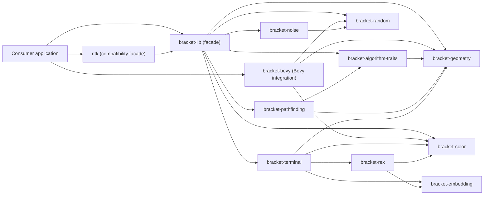
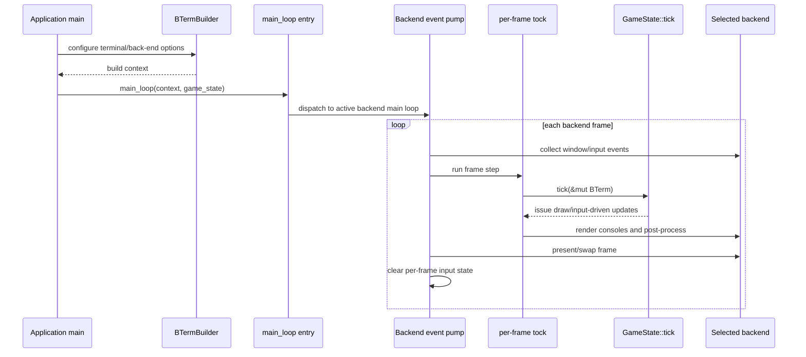

# Architecture

`bracket-lib` is a Rust workspace organized around a stable facade (`bracket-lib`)
with focused crates for rendering, algorithms, geometry, colors, random utilities,
and compatibility wrappers. The architecture favors composability: users can adopt
the full toolkit or only the crates they need.

## Design goals

1. Keep a simple high-level entry point via `bracket_lib::prelude::*`.
2. Split domains into independent crates to control compile-time and dependency surface.
3. Support multiple rendering targets through Cargo features (instead of runtime branching).
4. Maintain compatibility for older `rltk` users while evolving the `bracket-*` family.

## Visual overview

## Crate map

| Crate                      | Responsibility                                                                               | Main collaborators                                                      |
| -------------------------- | -------------------------------------------------------------------------------------------- | ----------------------------------------------------------------------- |
| `bracket-lib` (root)       | Meta-crate facade that re-exports major systems through `prelude` and forwards feature flags | `bracket-*` crates, end-user apps                                       |
| `rltk`                     | Backward-compatible facade that maps legacy names onto `bracket-lib`                         | `bracket-lib`, tutorial/legacy codebases                                |
| `bracket-bevy`             | Bevy-oriented CP437/ASCII integration entry point                                            | `bevy`, `bracket-color`, `bracket-geometry`, `bracket-random`           |
| `bracket-terminal`         | Terminal runtime, frame loop, input, and backend-specific rendering                          | `bracket-color`, `bracket-geometry`, `bracket-rex`, `bracket-embedding` |
| `bracket-pathfinding`      | A\*, Dijkstra, and FOV over user-provided map traits                                         | `bracket-algorithm-traits`, `bracket-geometry`                          |
| `bracket-algorithm-traits` | Abstractions (`Algorithm2D/3D`, `BaseMap`) that decouple algorithms from storage layout      | `bracket-geometry`, `bracket-pathfinding`                               |
| `bracket-noise`            | Noise generation utilities (FastNoise-style)                                                 | `bracket-random`                                                        |
| `bracket-geometry`         | Points, rectangles, lines, circles, and distance helpers                                     | `bracket-algorithm-traits`, `bracket-pathfinding`, `bracket-terminal`   |
| `bracket-color`            | RGB/HSV types, palette support, and color transforms                                         | `bracket-terminal`, `bracket-rex`, `bracket-bevy`                       |
| `bracket-random`           | RNG and optional dice-string parsing                                                         | `bracket-noise`, `bracket-bevy`                                         |
| `bracket-rex`              | RexPaint import/export support                                                               | `bracket-color`, `bracket-embedding`, `bracket-terminal`                |
| `bracket-embedding`        | Binary asset embedding/linking primitives used across runtime crates                         | `bracket-terminal`, `bracket-rex`                                       |

## Application runtime flow

## Feature and backend strategy

`bracket-terminal` owns backend selection with feature flags:

- `opengl` (default)
- `webgpu`
- `cross_term`
- `curses`

At the facade layer, `bracket-lib` and `rltk` expose corresponding high-level
features (`opengl`, `webgpu`, `crossterm`, `curses`) so applications configure
rendering once at the entry crate.

## Integration paths

1. **Default path:** use `bracket-lib` and import from `bracket_lib::prelude::*`.
2. **Selective path:** depend on only the required crates (for example `bracket-random` + `bracket-pathfinding`).
3. **Compatibility path:** use `rltk` for older code/tutorials that expect `Rltk` naming.
4. **Bevy path:** use `bracket-bevy` for terminal-style workflows in Bevy projects.

5. The application creates a `BTerm` context with `BTermBuilder`, then starts `bracket_terminal::main_loop`.
6. `main_loop` routes execution to the selected backend implementation (OpenGL/WebGPU/Crossterm/Curses).
7. On each frame, backend code gathers input/events, executes the per-frame tick path, and calls `GameState::tick(&mut BTerm)`.
8. After `tick`, console buffers are rendered (plus optional post-processing where supported), the frame is presented, and transient input state is cleared for the next frame.

## Extension points and boundaries

- Implement `Algorithm2D`/`Algorithm3D` and `BaseMap` on your own map types to plug into pathfinding/FOV.
- Keep backend-specific behavior behind feature gates rather than cross-cutting runtime checks.
- Keep crate responsibilities focused (rendering/runtime in `bracket-terminal`, algorithms in `bracket-pathfinding`, traits in `bracket-algorithm-traits`).
- Add optional capabilities (`serde`, `threaded`, backend features) as opt-in features.

## Visibility rules

- Keep top-level facades (`bracket-lib`, `rltk`, `bracket-bevy`) stable for consumers; prefer extending these via additive APIs.
- Keep crate internals private by default, and only expose cross-crate/public types needed by downstream users.
- Use `prelude` modules as the primary ergonomic export surface; avoid leaking implementation-only modules.
- Gate optional platform or ecosystem integrations with feature flags instead of unconditional public APIs.

## File conventions

- Workspace crates live in dedicated directories (`bracket-*`, `rltk`) with their own `Cargo.toml` and `src/`.
- Place crate entry points in `src/lib.rs`; keep domain logic in focused internal modules.
- Keep runnable samples in crate-local `examples/` to demonstrate crate-specific features.
- Define backend and optional capabilities in each crate's `Cargo.toml` feature section, and forward high-level features through facade crates when appropriate.
